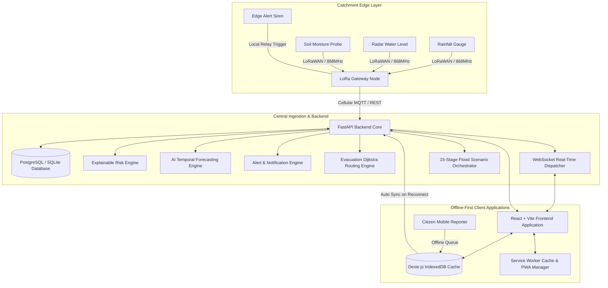

# SIH26192: Flash Flood Prediction & Early Warning System for Mountainous Regions

> **Hyper-local AI-driven real-time flash flood forecasting, early-warning, and disaster management platform for mountainous catchments.**

---

## 📖 Project Overview
Mountainous regions (such as the Mandakini and Alaknanda river basins in Uttarakhand) suffer from steep slopes, rapid surface runoff, cloudbursts, and frequent cellular communications blackouts.

The **SIH26192 Platform** provides a complete end-to-end disaster mitigation pipeline:
1. **Physical Edge Sensing & LoRaWAN Simulation**: Autonomous threshold checks and edge siren triggering during grid failures.
2. **Explainable Hydrological Risk Engine**: Transparent multi-factor weighted scoring across 6 domain parameters.
3. **AI Temporal Forecasting**: 30, 60, 90, and 120-minute horizon water level prediction with high Nash-Sutcliffe Efficiency (NSE = 0.915).
4. **Geo-Fenced Early Warnings**: Multi-channel broadcast (SMS, Voice IVR, Web Push, Sirens).
5. **Hazard-Aware Evacuation Routing**: Dijkstra routing algorithm avoiding flooded river corridors.
6. **Crowd-Sourced Ground Truth Reports**: Geo-tagged field reports with sensor verification.
7. **Offline-First Progressive Web App (PWA)**: Standalone installable PWA with IndexedDB queue and background synchronization.
8. **15-Stage Presentation Demo Engine**: Deterministic live flood scenario progression for hackathon evaluations.

---

## 🏛️ System Architecture



---

## 🚀 Quick Start Guide

### 1. Run Everything via Docker Compose
```bash
docker compose up --build -d
```
- **Frontend PWA App**: `http://localhost:5173`
- **FastAPI REST Backend & Interactive Swagger Docs**: `http://localhost:8000/docs`

### 2. Run Locally for Development

#### Backend:
```bash
cd backend
pip install -r requirements.txt
python -m app.db.init_db
uvicorn app.main:app --host 0.0.0.0 --port 8000 --reload
```

#### Frontend:
```bash
cd frontend
npm install
npm run dev
```

---

## 🧪 Testing Suite

### Backend Pytest Suite (74/74 Passing)
```bash
pytest backend/tests/ -v
```

### Frontend Typecheck & Build (0 Errors)
```bash
cd frontend
npm run build
```

---

## 📚 Complete Project Documentation (`docs/`)

- [System Architecture](file:///docs/architecture.md) – End-to-end design, data flows, and sub-systems.
- [REST & WebSocket API Reference](file:///docs/api.md) – Comprehensive API endpoint specifications.
- [Database Schema & Models](file:///docs/database.md) – 11 database tables, relations, and IndexedDB entities.
- [AI Forecasting Model](file:///docs/ai-model.md) – Temporal architecture, hydrological features, and NSE metrics.
- [15-Stage Flood Demo Guide](file:///docs/demo.md) – Hackathon presentation scenario walkthrough.
- [Deployment Guide](file:///docs/deployment.md) – Docker Compose, environment variables, and production setup.

---

## 👥 Role-Based Access Control (RBAC) Accounts

| Role | Email | Password | Permissions |
| :--- | :--- | :--- | :--- |
| **Super Admin** | `admin@flashflood.gov.in` | `AdminPass123!` | Full System Control, Config, Evac Management |
| **Government Official** | `official@uk.gov.in` | `OfficialPass123!` | Alerts, Evac Centers, Analytics, Command Room |
| **Response Team / NDRF** | `responder@ndrf.gov.in` | `ResponderPass123!`| Citizen Verification, Evacuation Routes |
| **Researcher** | `researcher@iit.ac.in` | `ResearchPass123!` | AI Models, Sensor Raw Telemetry, Analytics |
| **Citizen** | `citizen@mandakini.in` | `CitizenPass123!` | Ground Reports, Safe Evacuation Routing |
