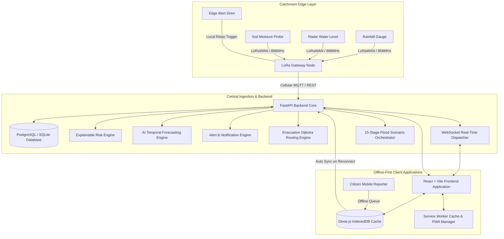

# System Architecture Document

## 1. Executive Summary & Problem Statement
The **SIH26192 Flash Flood Early Warning Platform** is an end-to-end, hyper-local disaster mitigation system engineered specifically for rugged mountainous terrains (e.g., Himalayan catchments such as the Mandakini and Alaknanda river basins in Uttarakhand). 

Mountainous regions suffer from steep slopes, rapid rainfall-runoff response times (<30–60 minutes), and severe telecommunication blackouts during cloudburst events. This architecture provides:
- Physical edge sensing with LoRaWAN and standalone threshold evaluation
- Centralized explainable physics-guided hydrological risk scoring
- Temporal deep learning river stage forecasting (30–120 min horizons)
- Multi-channel early warning broadcast (SMS, Voice IVR, Web Push, Solar Sirens)
- Hazard-aware shortest-path evacuation routing avoiding active flood polygons
- Offline-first Progressive Web App (PWA) with IndexedDB queue and background synchronization

---

## 2. High-Level Architecture Diagram

---

## 3. Core Architectural Subsystems

### 3.1 Catchment Edge Simulation Layer (`edge-simulator/`)
- Autonomous field nodes capable of standalone threshold evaluation.
- Local LoRa buffer retains telemetry during cellular infrastructure failures.
- Direct hardware relay interface to fire solar sirens when local risk > 75 pts.

### 3.2 Backend Service Engines (`backend/app/services/`)
1. **Explainable Risk Engine (`risk_engine.py`)**: Transparent weighted scoring across 6 hydrological factors (Rainfall, River Gauge, Soil Moisture, Slope, Elevation, Historical Flood Risk).
2. **AI Forecasting Engine (`ai-engine/`)**: Multi-horizon temporal model (30, 60, 90, 120 mins) calculating probability distributions and confidence scores.
3. **Alert Engine (`alert_engine.py`)**: Evaluates severity tiers (`INFO`, `WARNING`, `DANGER`, `EMERGENCY`), computes geo-fenced danger buffer polygons, and records notification logs.
4. **Evacuation Routing Engine (`evacuation_routing.py`)**: Grid/graph Dijkstra algorithm that steers civilians away from flooded river valleys towards elevated shelters.
5. **Analytics Engine (`analytics_engine.py`)**: High-performance telemetry aggregation, 8-chart series compilation, and CSV export.
6. **Demo Orchestrator (`demo_orchestrator.py`)**: 15-stage deterministic scenario engine for hackathon presentations.

### 3.3 Offline Progressive Web App (PWA) Layer (`frontend/src/`)
- Registered Service Worker caches app shell, HTML, JS, CSS, and static assets.
- IndexedDB via `Dexie.js` stores snapshots of sensors, watersheds, risk zones, alerts, evacuation centers, and citizen reports.
- Resilient citizen reporting synchronization queue (`PENDING` -> `SYNCING` -> `SYNCED` / `FAILED`).
