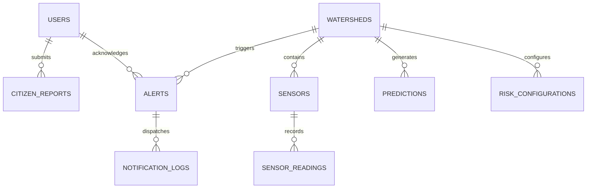

# Database Schema & Data Models

The platform supports **PostgreSQL with PostGIS** in production environments and an embedded **SQLite** database for local prototyping, testing, and edge computing.

---

## 1. Entity-Relationship Summary

---

## 2. Core Database Tables (SQLAlchemy Base)

### 1. `users`
- `id` (Integer, Primary Key)
- `name` (VARCHAR(100))
- `email` (VARCHAR(150), Unique, Indexed)
- `hashed_password` (VARCHAR(255))
- `role` (Enum: `CITIZEN`, `RESEARCHER`, `RESPONSE_TEAM`, `GOVERNMENT_OFFICIAL`, `ADMIN`)
- `phone`, `village`, `ward`, `district`, `state`, `latitude`, `longitude`, `created_at`

### 2. `watersheds`
- `id` (Integer, Primary Key)
- `code` (VARCHAR(50), Unique)
- `name` (VARCHAR(150))
- `district`, `state` (VARCHAR(100))
- `area_sq_km` (Float)
- `average_slope_deg` (Float)
- `elevation_m` (Float)
- `historical_risk_score` (Float)
- `geometry_geojson` (TEXT)

### 3. `sensors`
- `id` (Integer, Primary Key)
- `sensor_code` (VARCHAR(50), Unique)
- `name` (VARCHAR(150))
- `sensor_type` (Enum: `RAINFALL`, `RIVER_LEVEL`, `SOIL_MOISTURE`, `WEATHER`, `MULTI_SENSOR`)
- `latitude`, `longitude`, `elevation_m`
- `status` (`ACTIVE`, `INACTIVE`, `MAINTENANCE`, `OFFLINE`)
- `battery_level_pct`, `signal_strength_dbm`
- `watershed_id` (ForeignKey `watersheds.id`)

### 4. `sensor_readings`
- `id` (Integer, Primary Key)
- `sensor_id` (ForeignKey `sensors.id`)
- `rainfall_intensity_mmh` (Float)
- `accumulated_rainfall_mm` (Float)
- `water_level_m` (Float)
- `rate_of_rise_mh` (Float)
- `soil_moisture_pct` (Float)
- `timestamp` (DateTime, Indexed)

### 5. `risk_evaluations`
- `id` (Integer, Primary Key)
- `watershed_id` (ForeignKey `watersheds.id`)
- `risk_score` (Float, 0–100)
- `risk_category` (`LOW`, `MODERATE`, `HIGH`, `CRITICAL`)
- `rainfall_score`, `river_score`, `soil_score`, `slope_score`, `elevation_score`, `historical_score`
- `calculated_at` (DateTime)

### 6. `risk_configurations`
- `id` (Integer, Primary Key)
- `watershed_id` (ForeignKey `watersheds.id`, Nullable for global defaults)
- `weight_rainfall`, `weight_river`, `weight_soil`, `weight_slope`, `weight_elevation`, `weight_historical`
- `threshold_low`, `threshold_moderate`, `threshold_high`, `threshold_critical`

### 7. `predictions`
- `id` (Integer, Primary Key)
- `watershed_id` (ForeignKey `watersheds.id`)
- `prediction_time`, `forecast_for`
- `minutes_ahead` (30, 60, 90, 120)
- `predicted_water_level_m`, `prediction_probability`, `risk_level`, `model_confidence`

### 8. `alerts`
- `id` (Integer, Primary Key)
- `watershed_id` (ForeignKey `watersheds.id`)
- `title`, `message`
- `severity` (`INFO`, `WARNING`, `DANGER`, `EMERGENCY`)
- `status` (`ACTIVE`, `ACKNOWLEDGED`, `RESOLVED`, `EXPIRED`)
- `center_lat`, `center_lon`, `danger_radius_km`, `danger_zone_geojson`
- `created_at`, `expires_at`

### 9. `citizen_reports`
- `id` (Integer, Primary Key)
- `user_id` (ForeignKey `users.id`, Nullable)
- `report_type` (`RIVER_RISING`, `FLASH_FLOOD`, `ROAD_BLOCKAGE`, `LANDSLIDE`, `BRIDGE_DAMAGE`, `HEAVY_RAINFALL`, `OTHER_EMERGENCY`)
- `description`, `latitude`, `longitude`, `image_url`
- `verification_status` (`PENDING`, `VERIFIED`, `REJECTED`)
- `confidence_score` (Float)
- `verified_by_user_id`, `verified_at`, `verification_notes`

### 10. `evacuation_centers`
- `id` (Integer, Primary Key)
- `name`, `district`, `state`
- `latitude`, `longitude`, `elevation_m`
- `capacity_people`, `current_occupancy`
- `is_active` (Boolean)

### 11. `notification_logs`
- `id` (Integer, Primary Key)
- `alert_id` (ForeignKey `alerts.id`)
- `channel` (`SMS`, `VOICE`, `PUSH`, `SIREN`)
- `recipient_or_endpoint`, `status`, `dispatched_at`

---

## 3. Client-Side IndexedDB Tables (`Dexie.js`)
- `sensors`: Cached telemetry sensors
- `watersheds`: Basin boundaries and characteristics
- `riskZones`: Dynamic risk polygons
- `alerts`: Active disaster alerts
- `evacuationCenters`: Emergency shelter details
- `citizenReports`: Offline report queue (`local_id`, `sync_status`, `sync_attempts`)
- `syncMetadata`: Last cloud synchronization timestamp and status
